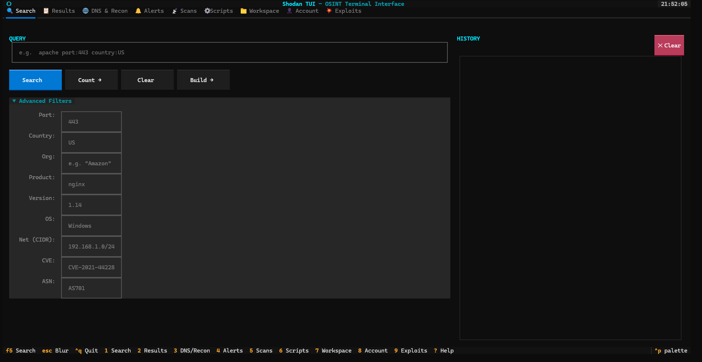

# shodan-tui

A terminal user interface for [Shodan](https://shodan.io) — built for OSINT, recon, and network monitoring workflows.



---

## Features

| Tab | Key | What it does |
|-----|-----|-------------|
| 🔍 **Search** | `1` | Full Shodan query syntax, filter builder, search history, free Count (no credits), paginated results |
| 📋 **Results** | `2` | Paginated result table with country/org/port facets sidebar, host detail overlay, JSON/CSV export |
| 🌐 **DNS & Recon** | `3` | Forward/reverse DNS lookup, subdomain enumeration, org footprint mapping |
| 🔔 **Alerts** | `4` | Create and manage network monitoring alerts for IPs and netblocks |
| 📡 **Scans** | `5` | Submit and track on-demand scans *(requires paid plan)* |
| ⚙ **Scripts** | `6` | Run built-in OSINT scripts or install your own |
| 📁 **Workspace** | `7` | Save targets, write notes, tag by investigation, re-scan saved hosts |
| 👤 **Account** | `8` | API plan info, query/scan credit usage, public IP display |
| 💥 **Exploits** | `9` | Search CVEs, Metasploit modules, Exploit-DB entries — no query credits consumed |

### Built-in Scripts

| Script | Description |
|--------|-------------|
| **Exposed RDP** | Internet-facing Remote Desktop Protocol servers |
| **Exposed Databases** | MongoDB, Elasticsearch, Redis, CouchDB, and more |
| **Log4Shell Scanner** | Hosts flagged as vulnerable to CVE-2021-44228 |
| **Open Webcams** | Accessible IP cameras indexed by Shodan |
| **Expired SSL Certs** | Hosts serving expired TLS certificates |

---

## Requirements

- Python 3.10 or newer
- A Shodan API key — [get one free at account.shodan.io](https://account.shodan.io)

> **Free tier** covers: basic search (1 result page/query), host lookup, DNS, exploit search, alerts.
> **Paid plans** unlock: full result pagination (100 results/page), on-demand scans, org footprint DNS, scan credits.

---

## Installation

```bash
# 1. Clone the repo
git clone https://github.com/yourusername/shodan-tui.git
cd shodan-tui

# 2. Create and activate a virtual environment
python -m venv .venv

# Linux / macOS
source .venv/bin/activate

# Windows (PowerShell)
.venv\Scripts\Activate.ps1

# 3. Install dependencies
pip install -r requirements.txt

# 4. Configure your API key
cp .env.example .env
# Open .env in your editor and set: SHODAN_API_KEY=your_key_here
```

---

## Usage

```bash
python main.py
```

The app opens on the **Search** tab. Your API credit balance loads automatically in the status bar at startup.

### Keyboard shortcuts

| Key | Action |
|-----|--------|
| `1` – `9` | Switch tabs directly |
| `F5` | Run search / refresh current tab |
| `Enter` | Open host detail for selected row |
| `s` | Save selected host to workspace |
| `R` | Refresh list (Alerts, Scans, Workspace, Scripts) |
| `?` | Help overlay (full keyboard reference) |
| `Ctrl+Q` | Quit |

### Search syntax

Shodan uses a filter-based query language. Some examples:

```
apache port:443 country:US
product:nginx version:1.18
org:"Amazon" has_vuln:true
ssl.cert.subject.cn:*.example.com
http.title:"Admin Panel" has_screenshot:true
```

See [`filter-reference.md`](filter-reference.md) for a complete list of all available search filters organized by category (General, HTTP, SSL, SSH, Cloud, and more).

---

## Writing Custom Scripts

Scripts are Python files that subclass `ShodanScript`. They appear in the **Scripts** tab and run as predefined searches.

```python
from shodan_tui.scripts.base import ShodanScript

class MyScript(ShodanScript):
    name        = "My OSINT Script"
    description = "Finds something interesting on the internet"
    author      = "yourname"
    version     = "1.0.0"
    tags        = ["recon", "custom"]
    query       = "product:nginx port:8080"
    facets      = "country,org"

    params = {
        "country": {
            "type": "str",
            "description": "2-letter country code to filter (e.g. US, DE)",
            "default": "",
        },
    }

    def build_query(self, **kwargs) -> str:
        q = self.query
        if kwargs.get("country"):
            q += f" country:{kwargs['country']}"
        return q
```

**Install your script** from the Scripts tab → **+ Add Script**, or drop the file into one of:

- `./user_scripts/` — project-local, committed with the repo
- `~/.config/shodan-tui/scripts/` — global, available across projects

See [`user_scripts/example_script.py`](user_scripts/example_script.py) for a fully documented template.

---

## Data storage

All user data is stored locally in `~/.config/shodan-tui/`:

| Path | Contents |
|------|----------|
| `workspace.json` | Saved targets, notes, tags, investigations |
| `history.json` | Last 100 search queries with timestamps |
| `exports/` | JSON and CSV exports from Search, Results, and Exploits tabs |
| `scripts/` | User-installed custom scripts |

Nothing is sent anywhere except directly to `api.shodan.io` and `exploits.shodan.io`.

---

## Project structure

```
shodan-tui/
├── main.py                      # Entry point
├── shodan_tui/
│   ├── api.py                   # Async Shodan API wrapper (httpx)
│   ├── app.py                   # Main Textual application + tab layout
│   ├── app.tcss                 # Retro terminal stylesheet
│   ├── config.py                # API key loading + data directory config
│   ├── storage.py               # Workspace and search history (local JSON)
│   ├── screens/                 # One file per tab
│   │   ├── search.py
│   │   ├── results.py
│   │   ├── dns.py
│   │   ├── alerts.py
│   │   ├── scans.py
│   │   ├── scripts.py
│   │   ├── workspace.py
│   │   ├── account.py
│   │   ├── exploits.py
│   │   └── host.py              # Host detail overlay (modal)
│   ├── scripts/
│   │   ├── base.py              # ShodanScript base class
│   │   ├── loader.py            # Dynamic script loader
│   │   └── builtin/             # 5 built-in OSINT scripts
│   └── widgets/
├── user_scripts/
│   └── example_script.py        # Custom script template
├── filter-reference.md          # Complete Shodan filter reference
├── shodan-api-reference.md      # Shodan REST API reference
├── .env.example                 # API key template
└── requirements.txt
```

---

## License

MIT
