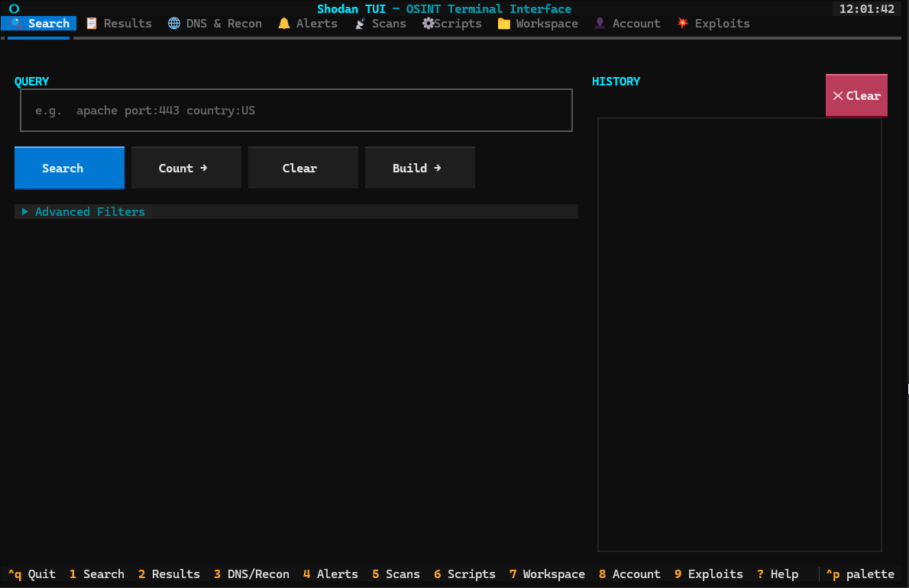
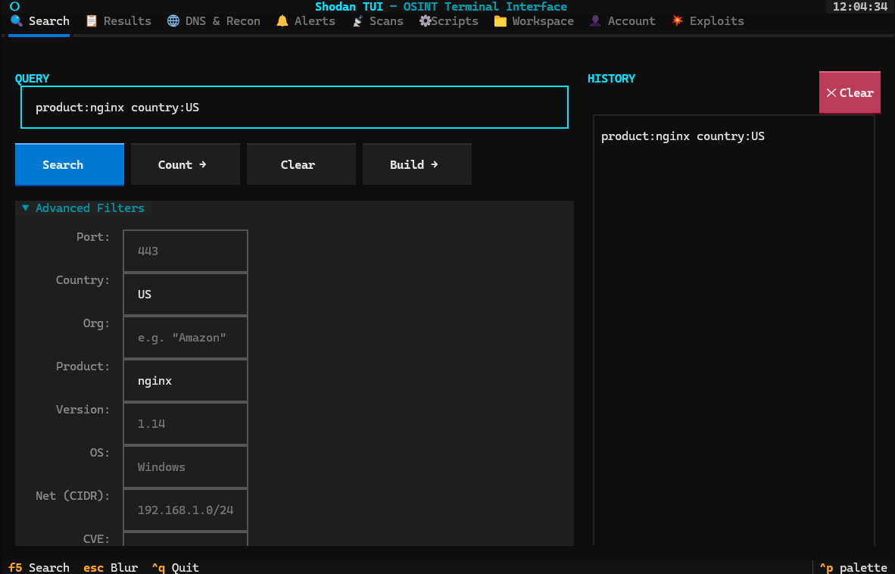
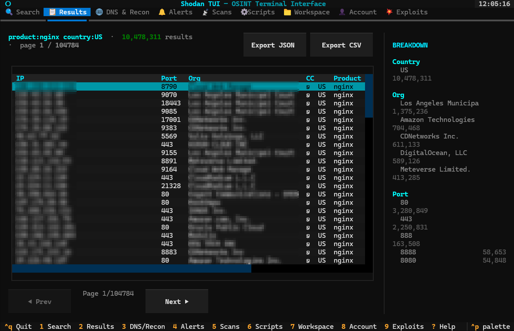
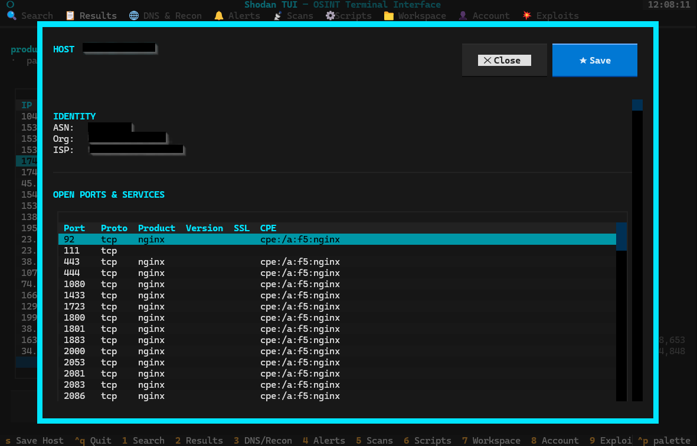
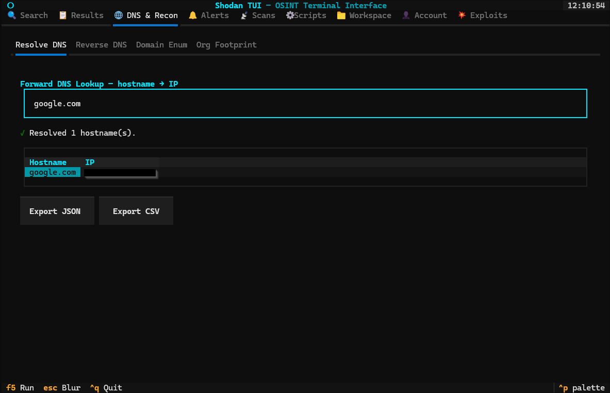
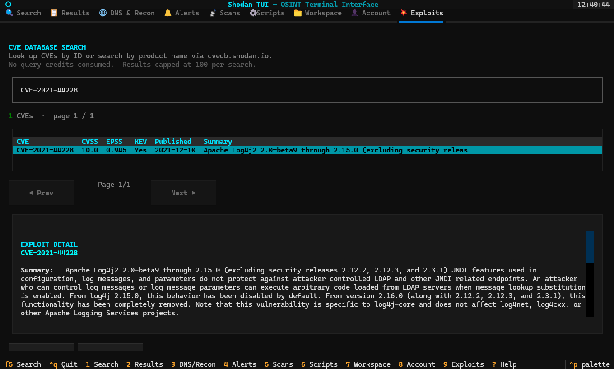
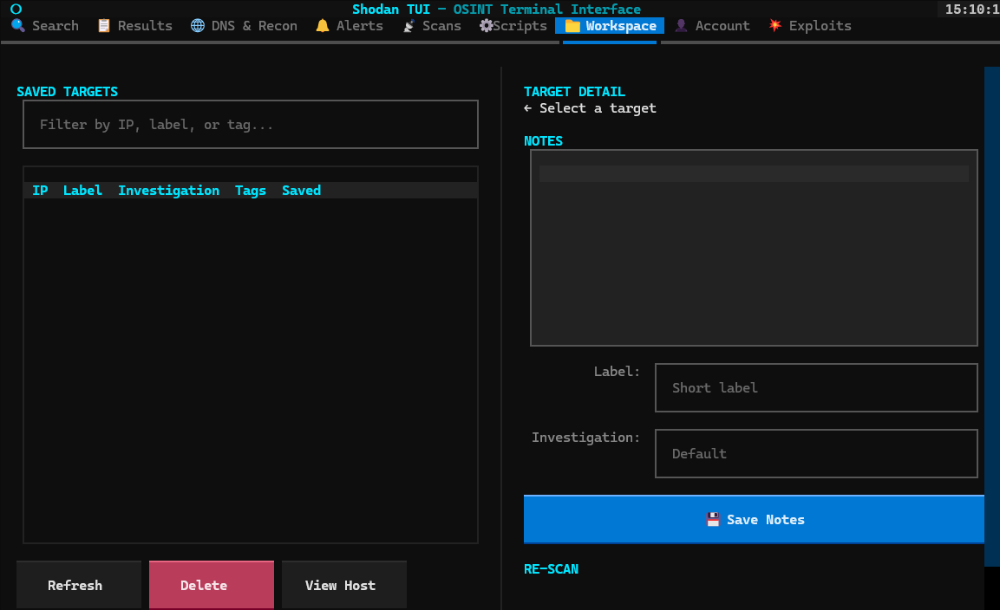
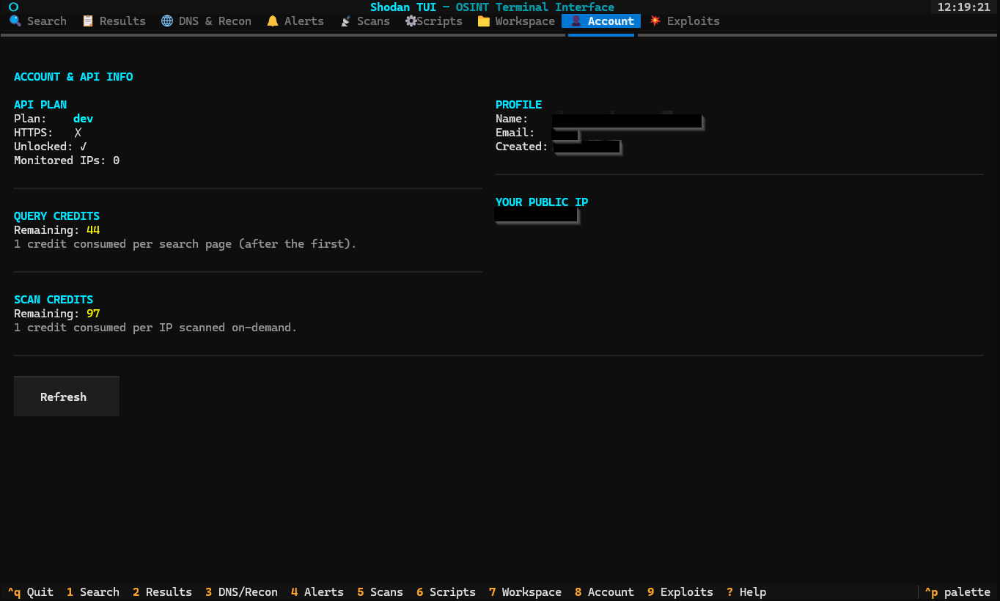

# shodan-tui

A terminal user interface for [Shodan](https://shodan.io) — built for OSINT, recon, and network monitoring workflows.



---

## Features

| Tab | Key | What it does |
|-----|-----|-------------|
| 🔍 **Search** | `1` | Full Shodan query syntax, filter builder, search history, free Count (no credits), paginated results |
| 📋 **Results** | `2` | Paginated result table with country/org/port facets sidebar, host detail overlay, JSON/CSV export   |
| 🌐 **DNS & Recon** | `3` | Forward/reverse DNS lookup, subdomain enumeration, org footprint mapping                        |
| 🔔 **Alerts** | `4` | Create and manage network monitoring alerts for IPs and netblocks                                    |
| 📡 **Scans** | `5` | Submit and track on-demand scans                                                                      |
| ⚙ **Scripts** | `6` | Run built-in OSINT scripts or install your own                                                       |
| 📁 **Workspace** | `7` | Save targets, write notes, tag by investigation, re-scan saved hosts                              |
| 👤 **Account** | `8` | API plan info, query/scan credit balance with refresh, public IP display                           |
| 💥 **Exploits** | `9` | Search CVEs by ID or keyword — shows CVSS, EPSS score, KEV status, and affected CPEs            |

### Built-in Scripts

| Script | Description |
|--------|-------------|
| **Exposed RDP** | Internet-facing Remote Desktop Protocol servers        |
| **Exposed Databases** | MongoDB, Elasticsearch, Redis, CouchDB, and more |
| **Log4Shell Scanner** | Hosts flagged as vulnerable to CVE-2021-44228    |
| **Open Webcams** | Accessible IP cameras indexed by Shodan               |
| **Expired SSL Certs** | Hosts serving expired TLS certificates           |

---

## Requirements

- Python 3.10 or newer
- A Shodan API key — [get one free at account.shodan.io](https://account.shodan.io)

---

## Installation

```bash
# 1. Clone the repo
git clone https://github.com/JesusEMenjivar/shodan-tui.git
cd shodan-tui

# 2. Create and activate a virtual environment
python -m venv .venv

# Linux / macOS
source .venv/bin/activate

# Windows (PowerShell)
.venv\Scripts\Activate.ps1

# 3. Install dependencies
pip install -r requirements.txt

# 4. Configure your API key
cp .env.example .env
# Open .env in your editor and set: SHODAN_API_KEY=your_key_here
```

---

## Usage

```bash
python main.py
```

Navigation is keyboard-driven. Press `1`–`9` to switch tabs, `?` to open the help overlay, and `Ctrl+Q` to quit.

### Keyboard shortcuts

| Key | Action |
|-----|--------|
| `1` – `9` | Switch tabs directly |
| `F5` / `Enter` | Run search / submit query |
| `Enter` | Open host detail for selected row |
| `s` | Save selected host to workspace |
| `R` | Refresh (Account, Alerts, Scans, Workspace, Scripts) |
| `?` | Help overlay (full keyboard reference) |
| `Ctrl+Q` | Quit |

---

## Walkthrough

### 🔍 Search (Tab 1)

Type any Shodan query and press `Enter` or `F5` to run it. Use **Count →** first to check how many results match without spending a credit.

**Example queries to try:**

```
# All nginx servers in the US
product:nginx country:US

# Apache servers with known vulnerabilities
apache has_vuln:true

# Devices with default login pages
http.title:"Welcome to nginx!"

# SSH servers running a specific version
product:OpenSSH version:7.4

# Hosts in an org's network range
org:"Cloudflare" port:443
```

The **Build →** button opens a filter builder if you prefer filling in fields over typing filters manually.



---

### 📋 Results (Tab 2)

Results load automatically after a search. The table shows IP, port, organization, country, product, hostname, and vulnerability count. The right panel breaks down the top countries, organizations, and ports in your result set.

Press `Enter` on any row to open the host detail overlay. Press `s` to save the host to your Workspace.

**To paginate:** use **◀ Prev** and **Next ▶** — each page load costs one query credit.



#### Host Detail

The host detail overlay shows the full picture for a single IP:

- ASN, org, ISP, location
- Every open port Shodan has seen, with product, version, and SSL status
- CVEs associated with the host, color-coded by CVSS severity
- Raw banner text from each port
- Hostnames and domains



---

### 🌐 DNS & Recon (Tab 3)

Four sub-tabs for the most common recon lookups. None of these consume query credits.

**Resolve** — hostname → IP

```
example.com
github.com, gitlab.com, bitbucket.org
```

**Reverse** — IP → hostnames

```
8.8.8.8
1.1.1.1, 1.0.0.1
```

**Domain Enum** — enumerate all subdomains Shodan has indexed for a root domain

```
example.com
```

Returns subdomain names, DNS record types, and last-seen timestamps. Good for mapping a target's external footprint quickly.

**Org Footprint** — all hosts indexed under an organization name

```
Cloudflare
Amazon Technologies
```



---

### 💥 Exploits (Tab 9)

Search the [Shodan CVE database](https://cvedb.shodan.io) by CVE ID or keyword. No query credits consumed.

**Search by CVE ID:**

```
CVE-2021-44228
CVE-2023-44487
CVE-2014-0160
```

**Search by product or keyword:**

```
apache
nginx
log4j
openssl
```

Results show CVSS score, EPSS exploit probability, and whether the CVE appears on CISA's Known Exploited Vulnerabilities (KEV) list. Select a row to expand the full detail panel with the summary, affected CPEs, and references.



---

### 📁 Workspace (Tab 7)

The workspace is a local investigation notebook. Save any host from the Results tab or Host Detail overlay by pressing `s`.

Each saved target has:
- IP and auto-filled label (from the org name)
- Free-text notes field
- Investigation name for grouping related targets
- Tags for filtering

Filter the list by typing in the search box — matches on IP, label, or tag.



---

### 👤 Account (Tab 8)

Shows your API plan, current query and scan credit balances, profile info, and your public IP. Press **Refresh [R]** to pull the latest credit counts from the API.



---

## Writing Custom Scripts

Scripts are Python files that subclass `ShodanScript`. They appear in the **Scripts** tab and run as predefined searches.

```python
from shodan_tui.scripts.base import ShodanScript

class MyScript(ShodanScript):
    name        = "My OSINT Script"
    description = "Finds something interesting on the internet"
    author      = "yourname"
    version     = "1.0.0"
    tags        = ["recon", "custom"]
    query       = "product:nginx port:8080"
    facets      = "country,org"

    params = {
        "country": {
            "type": "str",
            "description": "2-letter country code to filter (e.g. US, DE)",
            "default": "",
        },
    }

    def build_query(self, **kwargs) -> str:
        q = self.query
        if kwargs.get("country"):
            q += f" country:{kwargs['country']}"
        return q
```

**Install your script** from the Scripts tab → **+ Add Script**, or drop the file into one of:

- `./user_scripts/` — project-local, committed with the repo
- `~/.config/shodan-tui/scripts/` — global, available across projects

See [`user_scripts/example_script.py`](user_scripts/example_script.py) for a fully documented template.

---

## Data storage

All user data is stored locally in `~/.config/shodan-tui/`:

| Path | Contents |
|------|----------|
| `workspace.json` | Saved targets, notes, tags, investigations |
| `history.json` | Last 100 search queries with timestamps |
| `exports/` | JSON and CSV exports from Search, Results, and Exploits tabs |
| `scripts/` | User-installed custom scripts |

Nothing is sent anywhere except directly to `api.shodan.io` and `cvedb.shodan.io`.

---

## Project structure

```
shodan-tui/
├── main.py                      # Entry point
├── shodan_tui/
│   ├── api.py                   # Async Shodan API wrapper (httpx)
│   ├── app.py                   # Main Textual application + tab layout
│   ├── app.tcss                 # Retro terminal stylesheet
│   ├── config.py                # API key loading + data directory config
│   ├── storage.py               # Workspace and search history (local JSON)
│   ├── screens/                 # One file per tab
│   │   ├── search.py
│   │   ├── results.py
│   │   ├── dns.py
│   │   ├── alerts.py
│   │   ├── scans.py
│   │   ├── scripts.py
│   │   ├── workspace.py
│   │   ├── account.py
│   │   ├── exploits.py
│   │   └── host.py              # Host detail overlay (modal)
│   ├── scripts/
│   │   ├── base.py              # ShodanScript base class
│   │   ├── loader.py            # Dynamic script loader
│   │   └── builtin/             # 5 built-in OSINT scripts
│   └── widgets/
├── user_scripts/
│   └── example_script.py        # Custom script template
├── filter-reference.md          # Complete Shodan filter reference
├── shodan-api-reference.md      # Shodan REST API reference
├── .env.example                 # API key template
└── requirements.txt
```

---

## Known Limitations

### Search & Results (Tabs 1–2)
- Paginating through results costs one query credit per page (same as the Shodan web UI — this is an API constraint with no workaround).

### Exploits Tab (Tab 9)
- CVE searches are capped at 100 results per search. Pagination within those 100 results is fully supported client-side.

---

## License

MIT
